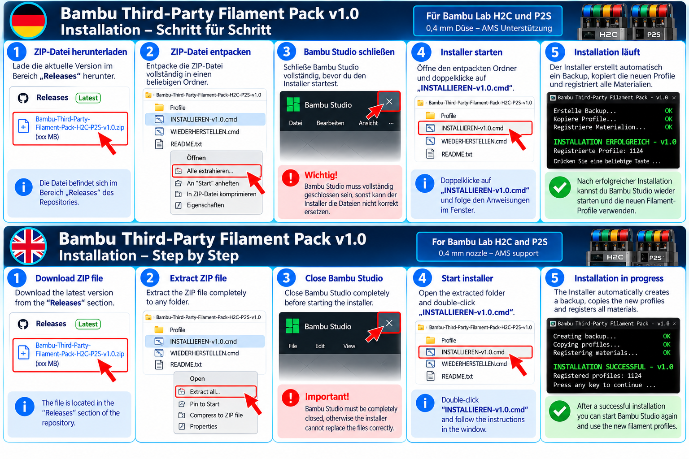
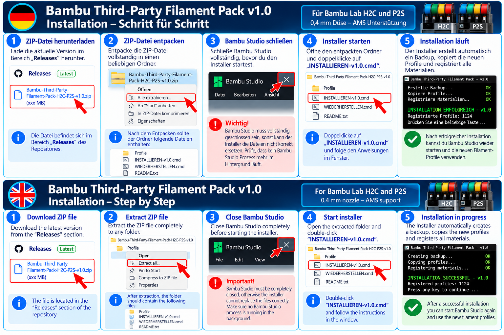
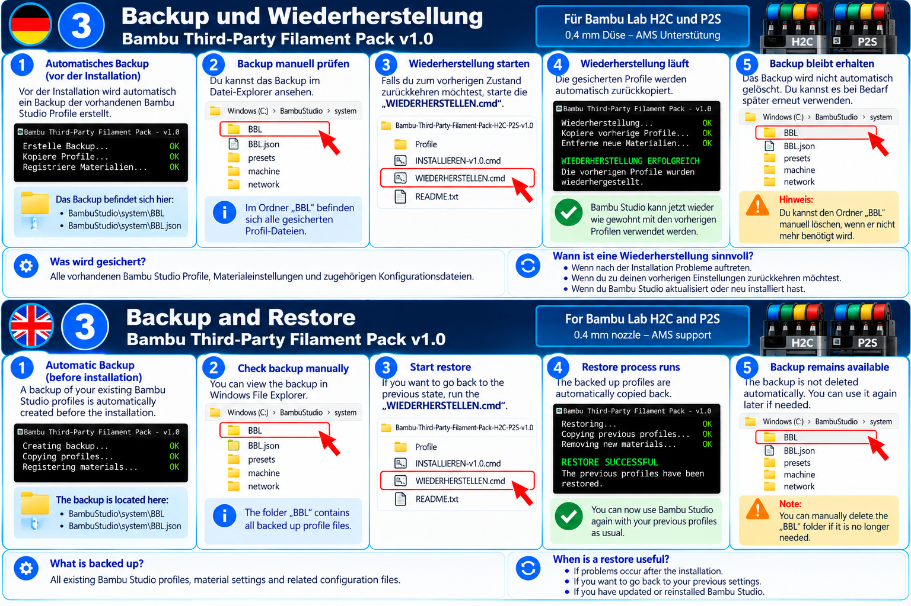

# Bambu Third-Party Filament Pack – H2C & P2S

Community filament profiles for **Bambu Lab H2C and P2S** with **0.4 mm nozzle** and AMS support.

Community-Filamentprofile für **Bambu Lab H2C und P2S** mit **0,4-mm-Düse** und AMS-Unterstützung.

---

## 🇬🇧 English

### About

This project provides additional third-party filament profiles for Bambu Studio.

The goal is to make third-party filament manufacturers directly selectable in the AMS material settings without requiring users to manually edit Bambu Studio configuration files.

The profiles were prepared and tested with a focus on:

- Bambu Lab H2C
- Bambu Lab P2S
- 0.4 mm nozzle
- AMS / AMS 2 Pro
- Bambu Studio 2.8.2.61
- BBL configuration package 2.8.0.6

### Included manufacturers

Version 1.0 includes profiles for:

- Amazon Basics
- ANYCUBIC
- BioPLA
- Breakaway / Support
- Eono
- ERYONE
- FLASHFORGE
- GIANTARM
- iSANMATE
- JAYO
- Overture
- SMARTFIL
- SUNLU
- TECBEARS
- TINMORRY
- WINKLE

The v1.0 package contains **1,124 registered profile files**.

---

### Installation

1. Download the latest ZIP package from the **Releases** section.
2. Extract the ZIP completely.
3. Close Bambu Studio completely.
4. Double-click:

   `INSTALLIEREN-v1.0.cmd`

5. Follow the instructions in the installer window.
6. A successful installation will display:

   `INSTALLATION ERFOLGREICH - v1.0`

   `Registrierte Profile: 1124`

7. Start Bambu Studio.
8. Open the AMS material settings and select the desired manufacturer and filament.

No permanent change to the Windows PowerShell execution policy is required.

#### Installation overview / Installationsübersicht

---

### AMS material selection

After installation, the included third-party filament profiles can be selected directly in the AMS material settings.

Select the desired manufacturer and filament profile and confirm the selection.

The profile can then be synchronized with the project filament selection in Bambu Studio.

#### AMS material selection / AMS-Materialauswahl

---

### Automatic backup

Before making changes, the installer automatically creates a **PRE-INSTALL backup**.

The backup contains the affected Bambu Studio profile data:

- `BambuStudio\system\BBL`
- `BambuStudio\system\BBL.json`

The package does **not** distribute or modify the user's `BambuStudio.conf`.

---

### Restore

If you want to return to the state before installation:

1. Close Bambu Studio completely.
2. Run:

   `WIEDERHERSTELLEN.cmd`

3. The latest PRE-INSTALL backup will be restored.
4. Start Bambu Studio again and verify the filament profiles.

#### Backup & Restore / Sicherung & Wiederherstellung

---

### Tested

Version 1.0 was tested on a clean installation using:

| Component | Tested version |
|---|---|
| Bambu Studio | 2.8.2.61 |
| BBL configuration package | 2.8.0.6 |
| Printer | Bambu Lab P2S |
| Nozzle | 0.4 mm |
| AMS | Yes |

Functional AMS tests included, among others:

- BioPLA PLA Wood
- ANYCUBIC PETG
- WINKLE ASA

The profiles remained assigned after confirmation in the AMS material settings and were correctly transferred to the project filament selection.

---

### Important

Filament behavior can vary depending on:

- filament color
- production batch
- printer
- nozzle
- environmental conditions
- manufacturer changes

These profiles should therefore be considered **starting points** and not a guarantee of optimal print results.

After major Bambu Studio or BBL configuration package updates, compatibility should be tested again before installation.

---

### Compatibility

The current release has been specifically prepared for **Bambu Lab H2C and P2S with 0.4 mm nozzle**.

The current functional AMS test was performed on the **Bambu Lab P2S**.

Support for other Bambu Lab printers or nozzle sizes is not guaranteed by this release.

---

### Disclaimer

This is an independent community project.

It is not an official Bambu Lab product and is not affiliated with or endorsed by Bambu Lab or the listed filament manufacturers.

All trademarks and product names belong to their respective owners and are used only to identify compatible products.

Use of the profiles and installer is at your own risk.

---

## 🇩🇪 Deutsch

### Über dieses Projekt

Dieses Projekt stellt zusätzliche Filamentprofile von Drittanbietern für Bambu Studio bereit.

Ziel ist es, Filamenthersteller von Drittanbietern direkt in den AMS-Materialeinstellungen auswählen zu können, ohne dass Benutzer die Konfigurationsdateien von Bambu Studio manuell bearbeiten müssen.

Die Profile wurden mit Schwerpunkt auf folgende Konfiguration vorbereitet:

- Bambu Lab H2C
- Bambu Lab P2S
- 0,4-mm-Düse
- AMS / AMS 2 Pro
- Bambu Studio 2.8.2.61
- BBL-Konfigurationspaket 2.8.0.6

### Enthaltene Hersteller

Version 1.0 enthält Profile für:

- Amazon Basics
- ANYCUBIC
- BioPLA
- Breakaway / Support
- Eono
- ERYONE
- FLASHFORGE
- GIANTARM
- iSANMATE
- JAYO
- Overture
- SMARTFIL
- SUNLU
- TECBEARS
- TINMORRY
- WINKLE

Das Paket v1.0 enthält insgesamt **1.124 registrierte Profildateien**.

---

### Installation

1. Das aktuelle ZIP-Paket im Bereich **Releases** herunterladen.
2. Die ZIP-Datei vollständig entpacken.
3. Bambu Studio vollständig schließen.
4. Folgende Datei per Doppelklick starten:

   `INSTALLIEREN-v1.0.cmd`

5. Den Anweisungen des Installers folgen.
6. Bei erfolgreicher Installation erscheint:

   `INSTALLATION ERFOLGREICH - v1.0`

   `Registrierte Profile: 1124`

7. Bambu Studio starten.
8. Die AMS-Materialeinstellungen öffnen und den gewünschten Hersteller und das gewünschte Filament auswählen.

Es ist **keine dauerhafte Änderung der Windows-PowerShell-Ausführungsrichtlinie** erforderlich.

#### Installationsübersicht / Installation overview

---

### AMS-Materialauswahl

Nach der Installation können die enthaltenen Drittanbieter-Filamentprofile direkt in den AMS-Materialeinstellungen ausgewählt werden.

Den gewünschten Hersteller und das entsprechende Filamentprofil auswählen und die Auswahl bestätigen.

Anschließend kann das Profil mit der Projekt-Filamentauswahl in Bambu Studio synchronisiert werden.

#### AMS-Materialauswahl / AMS material selection

---

### Automatische Sicherung

Vor Änderungen erstellt der Installer automatisch eine **PRE-INSTALL-Sicherung**.

Die Sicherung enthält die betroffenen Bambu-Studio-Profildaten:

- `BambuStudio\system\BBL`
- `BambuStudio\system\BBL.json`

Das Paket verteilt oder verändert **nicht** die persönliche `BambuStudio.conf` des Benutzers.

---

### Wiederherstellung

Wenn der Zustand vor der Installation wiederhergestellt werden soll:

1. Bambu Studio vollständig schließen.
2. Folgende Datei starten:

   `WIEDERHERSTELLEN.cmd`

3. Die zuletzt erstellte PRE-INSTALL-Sicherung wird wiederhergestellt.
4. Bambu Studio anschließend erneut starten und die Filamentprofile überprüfen.

#### Sicherung & Wiederherstellung / Backup & Restore

---

### Getestet

Version 1.0 wurde auf einer sauberen Installation mit folgender Konfiguration getestet:

| Komponente | Getestete Version |
|---|---|
| Bambu Studio | 2.8.2.61 |
| BBL-Konfigurationspaket | 2.8.0.6 |
| Drucker | Bambu Lab P2S |
| Düse | 0,4 mm |
| AMS | Ja |

Funktionale AMS-Tests wurden unter anderem mit folgenden Profilen durchgeführt:

- BioPLA PLA Wood
- ANYCUBIC PETG
- WINKLE ASA

Die Profile blieben nach der Bestätigung in den AMS-Materialeinstellungen erhalten und wurden korrekt in die Projekt-Filamentauswahl übernommen.

---

### Wichtig

Das Druckverhalten eines Filaments kann unter anderem von folgenden Faktoren abhängen:

- Filamentfarbe
- Produktionscharge
- Drucker
- Düse
- Umgebungsbedingungen
- Änderungen durch den Hersteller

Die Profile sollten daher als **Ausgangspunkte** betrachtet werden und stellen keine Garantie für optimale Druckergebnisse dar.

Nach größeren Updates von Bambu Studio oder des BBL-Konfigurationspakets sollte die Kompatibilität vor einer erneuten Installation überprüft werden.

---

### Kompatibilität

Die aktuelle Version wurde speziell für **Bambu Lab H2C und P2S mit 0,4-mm-Düse** vorbereitet.

Der aktuelle funktionale AMS-Test wurde auf einem **Bambu Lab P2S** durchgeführt.

Die Unterstützung anderer Bambu-Lab-Drucker oder anderer Düsengrößen wird mit dieser Version nicht garantiert.

---

### Haftungsausschluss

Dies ist ein unabhängiges Community-Projekt.

Es handelt sich **nicht um ein offizielles Produkt von Bambu Lab**. Das Projekt steht in keiner Verbindung zu Bambu Lab oder den aufgeführten Filamentherstellern und wird von diesen nicht offiziell unterstützt oder empfohlen.

Alle Marken- und Produktnamen gehören ihren jeweiligen Eigentümern und werden ausschließlich zur Identifizierung kompatibler Produkte verwendet.

Die Verwendung der Profile und des Installers erfolgt auf eigene Verantwortung.

---

## Version

**v1.0 – Initial public release / Erste öffentliche Version**

Developed and tested as a community project by **Naumann Consulting / 3D Service**.

Entwickelt und getestet als Community-Projekt von **Naumann Consulting / 3D Service**.
